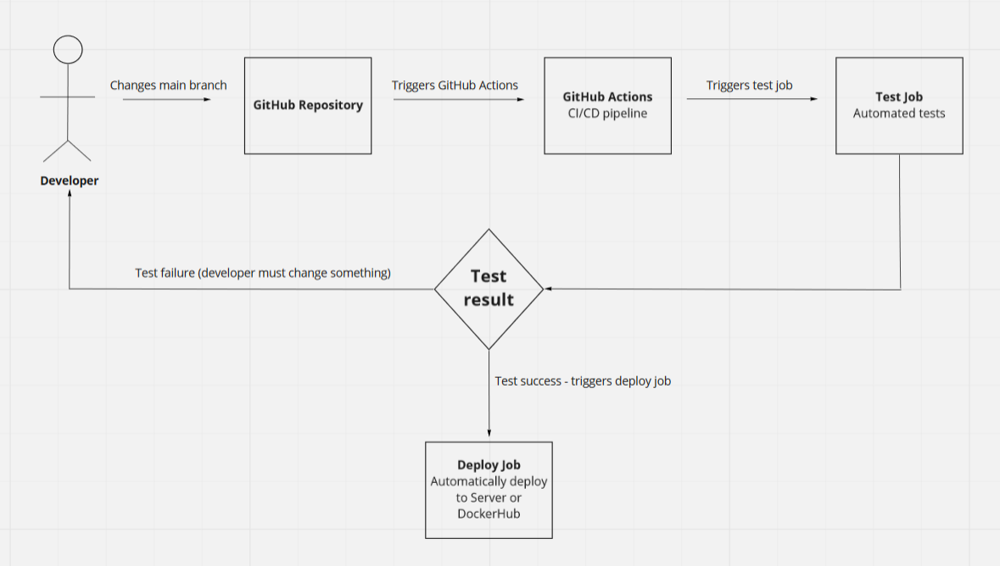

#  CI/CD Pipeline Best Practices 
***

## 1. “Only Way to Deploy to Production” 

The CI / CD pipeline must be the only mechanism by which the code enters the production environment.
 
 

## 2.  “Which processes and tests to automate first”

Decide which processes to automate first. All possible dependencies and their impact should be considered. First: automate the compilation of the code. 
Then: and then various tests.  
 
 

## 3. “Run Your Fastest Tests Early”

Priority is given to the fastest tests, followed by the longer and more complex ones. For example, first the unit tests, then the integration tests. 
 
 

## 4. “Release often”

Different methods are used. 
It is good practice to use Blue-green implementation: It starts with two identical production environments, one of which is "active" production. 
The other is empty. When a new version is released, the changes are moved to the inactive environment and it becomes active and the other inactive.
So, if something goes wrong, you can easily make the other environment active (the one that does not contain the new release). 
 
 

## 5. “Minimize Branching” 

Minimize branching in your version control system. Typically, CI / CD systems are set up to monitor and test changes involved in only one or several branches.
 
 

## 6. “Use on-demand testing environments” 

To perform the tests in containers. 
This approach allows the quality assurance team to deploy an image of a container instead of downloading a compilation from the CI server 
and installing it in a separate environment.
 
 

## 7. “Security first” 

Because the CI / CD system offers access to code base and credentials for deployment in different environments, it is often the main target for attacks.
Therefore, isolation of CI / CD systems should be considered by placing them in a secure internal network.  
 
 

